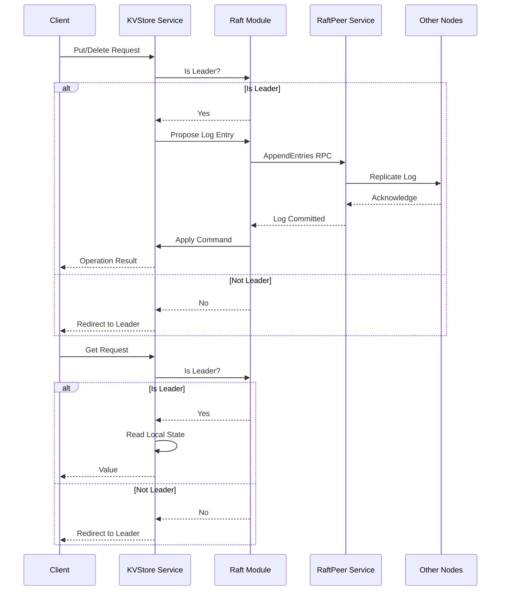

## kv-store-raft


Scalable and fault-tolerant distributed key-value store implementing the Raft consensus protocol for strong consistency. Based on the [Raft Consensus Algorithm](http://nil.lcs.mit.edu/6.824/2020/papers/raft-extended.pdf) extended paper by Diego Ongaro and John Ousterhout. The underlying details of client interaction design differ slightly from the specification in the paper.

#### Key Points:

- Fault tolerance is achieved via state-machine replication.
- Strong consistency is guaranteed by the Raft protocol (implemented from scratch).
- Networking support built using the Go RPC package (instead of gRPC).
- High performance is achieved via sharding and replica groups. (🚧)
- AWS EC2 hosting & S3 storage for enterprise-grade durability and scalability. (🚧)

#### Potential Improvement:

- Snapshotting / log-structured merge trees for Raft log compaction.

Note: I will not be including snapshotting/log compaction in this implementation. Feel free to make a PR and contribute! (ref: [Raft Paper: Section 7 & 8](https://raft.github.io/raft.pdf))

### Integration Flow (Single Replica Group)



### KV Store Client Usage

#### Import

```go
import "github.com/vismaysur/kv-store-raft/internal/kvservice"
```

#### Initialization

```go
peerAddresses := []string{":8000", ":8001", ":8002", ":8003", ":8004"}
clerk := kvservice.StartServers(peerAddresses)
```

- `peerAddresses`: List of server addresses for replica nodes.
- `StartServers`: Initializes servers and returns a `Clerk` with auto-incremented client ID.
- Includes 2-second delay for server initialization.

#### Operations

```go
value, err := clerk.Get(key)
err := clerk.Put(key, value)
err := clerk.Append(key, additionalValue)
```

- `Get(key string) (string, error)`: Retrieves value for given key.
- `Put(key string, value string) error`: Sets value for given key.
- `Append(key string, arg string) error`: Appends value to existing key's value (treated as Put if key does not exist).

#### Concurrency

`Clerk` is thread-safe. Multiple goroutines can use the same instance concurrently.

#### Server Management

- Each server in `peerAddresses` acts as a backup storage node.
- Ensures fault tolerance and high availability.
- Client handles leader election and failover automatically.

#### Client Identification

- `StartServers` uses an auto-incremented client ID.
- Unique IDs prevent duplicate operations during network failures or retries.

#### Example

```go
package main

import (
	"fmt"
	"log"
	"os"
	"path"

	kvservice "github.com/vismaysur/kv-store-raft/internal/kv-service"
)

func main() {
	// create a temporary directory for this demo (change this as you require)
	cwd, _ := os.Getwd()
	storagePath := path.Join(cwd, "/server_store")
	if err := os.MkdirAll(storagePath, 0755); err != nil {
		log.Fatal(err)
	}

	// example code:
	peerAddresses := []string{":8000", ":8001", ":8002", ":8003", ":8004"}
	clerk := kvservice.StartServers(peerAddresses, storagePath)

	key := "k1"
	value := "v1"
	clerk.Put(key, value)

	out, _ := clerk.Get(key)
	fmt.Println(out)

	additionalValue := "->v2"
	_ = clerk.Append(key, additionalValue)

	out, _ = clerk.Get(key)
	fmt.Println(out)

	// play around!
}
```

### Test Commands

To test for linearizability and fault tolerance, run the following command:

```sh
make test-kvstore
```

To test raft consensus in isolation, run the following command:

```sh
make test-raft
```

### Additional References

- [MIT 6.8240 Spring 20'](https://www.youtube.com/watch?v=64Zp3tzNbpE&list=PLrw6a1wE39_tb2fErI4-WkMbsvGQk9_UB&index=7)
- [ZooKeeper](https://www.usenix.org/legacy/event/atc10/tech/full_papers/Hunt.pdf)
- [CRAQ](https://www.usenix.org/legacy/event/usenix09/tech/full_papers/terrace/terrace.pdf)
- [Aurora DB - Cloud Replicated DB](https://pages.cs.wisc.edu/~yxy/cs764-f20/papers/aurora-sigmod-17.pdf)
- [Fringipani - Cache Consistency](https://pdos.csail.mit.edu/6.824/papers/thekkath-frangipani.pdf)
