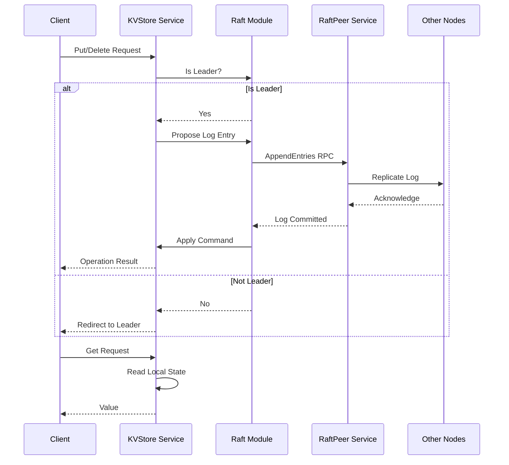

## kv-store-raft


Scalable and fault-tolerant distributed key-value store implementing the Raft consensus protocol for strong consistency. Based on the [Raft Consensus Algorithm](http://nil.lcs.mit.edu/6.824/2020/papers/raft-extended.pdf) extended paper by Diego Ongaro and John Ousterhout.

**Key Points:**

- Fault tolerance is achieved via state-machine replication.
- Strong consistency is guaranteed by the Raft protocol (implemented from scratch).
- GETS can be served from any server node. PUTS/APPENDS can only be served by leader nodes.
- High performance is achieved via sharding and replica groups. (🚧)
- Support for AWS S3 storage for enterprise-grade durability and scalability. (🚧)

### Integration Flow



### Test Command

To run tests, use the following command:

```sh
make test
```

### Additional References

- [MIT 6.8240 Spring 20'](https://www.youtube.com/watch?v=64Zp3tzNbpE&list=PLrw6a1wE39_tb2fErI4-WkMbsvGQk9_UB&index=7)
- [ZooKeeper](https://www.usenix.org/legacy/event/atc10/tech/full_papers/Hunt.pdf)
- [CRAQ](https://www.usenix.org/legacy/event/usenix09/tech/full_papers/terrace/terrace.pdf)
- [Aurora DB - Cloud Replicated DB](https://pages.cs.wisc.edu/~yxy/cs764-f20/papers/aurora-sigmod-17.pdf)
- [Fringipani - Cache Consistency](https://pdos.csail.mit.edu/6.824/papers/thekkath-frangipani.pdf)
